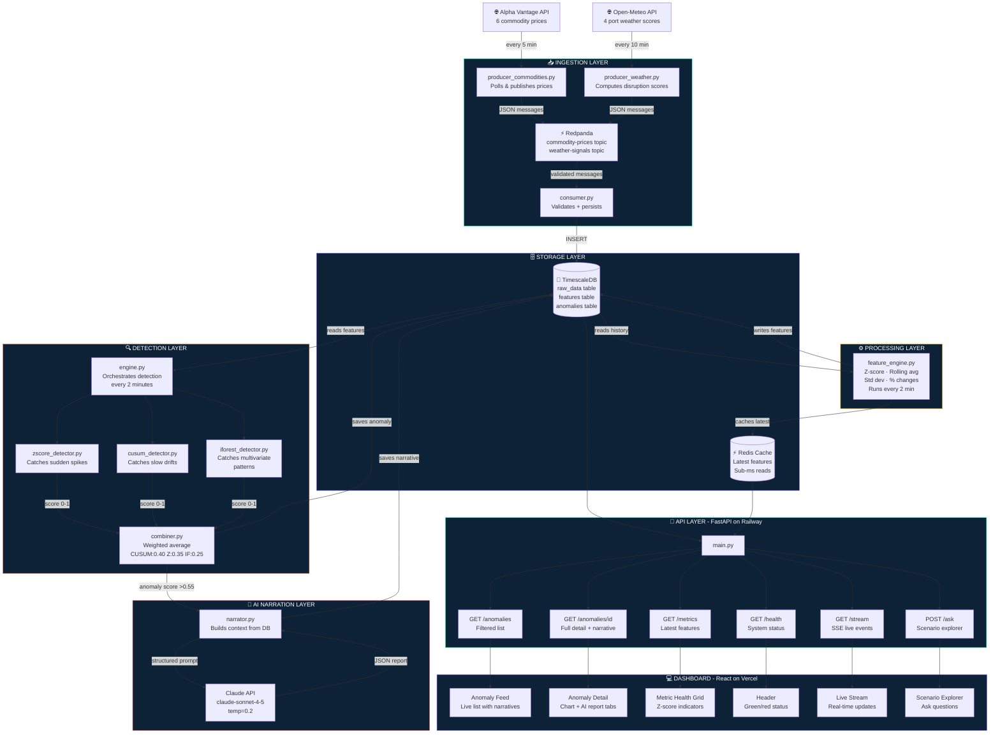

# Architecture

```mermaid
flowchart TD
    AV["🌐 Alpha Vantage API\n6 commodity prices"] -->|every 5 min| PC
    OM["🌐 Open-Meteo API\n4 port weather scores"] -->|every 10 min| PW

    subgraph Ingestion ["📥 INGESTION LAYER"]
        PC["producer_commodities.py\nPolls & publishes prices"]
        PW["producer_weather.py\nComputes disruption scores"]
        PC -->|JSON messages| RP
        PW -->|JSON messages| RP
        RP["⚡ Redpanda\ncommodity-prices topic\nweather-signals topic"]
        RP -->|validated messages| CS
        CS["consumer.py\nValidates + persists"]
    end

    CS -->|INSERT| DB

    subgraph Storage ["🗄️ STORAGE LAYER"]
        DB[("🐘 TimescaleDB\nraw_data table\nfeatures table\nanomalies table")]
        RD[("⚡ Redis Cache\nLatest features\nSub-ms reads")]
    end

    DB -->|reads history| FE

    subgraph Processing ["⚙️ PROCESSING LAYER"]
        FE["feature_engine.py\nZ-score · Rolling avg\nStd dev · % changes\nRuns every 2 min"]
    end

    FE -->|writes features| DB
    FE -->|caches latest| RD

    DB -->|reads features| DE

    subgraph Detection ["🔍 DETECTION LAYER"]
        DE["engine.py\nOrchestrates detection\nevery 2 minutes"]
        DE --> ZS["zscore_detector.py\nCatches sudden spikes"]
        DE --> CU["cusum_detector.py\nCatches slow drifts"]
        DE --> IF["iforest_detector.py\nCatches multivariate\npatterns"]
        ZS -->|score 0-1| CB
        CU -->|score 0-1| CB
        IF -->|score 0-1| CB
        CB["combiner.py\nWeighted average\nCUSUM:0.40 Z:0.35 IF:0.25"]
    end

    CB -->|anomaly score >0.55| NR
    CB -->|saves anomaly| DB

    subgraph Narration ["🤖 AI NARRATION LAYER"]
        NR["narrator.py\nBuilds context from DB"]
        NR -->|structured prompt| CL["Claude API\nclaude-sonnet-4-5\ntemp=0.2"]
        CL -->|JSON report| NR
        NR -->|saves narrative| DB
    end

    DB --> API
    RD --> API

    subgraph Backend ["🚀 API LAYER - FastAPI on Railway"]
        API["main.py"]
        API --> R1["GET /anomalies\nFiltered list"]
        API --> R2["GET /anomalies/id\nFull detail + narrative"]
        API --> R3["GET /metrics\nLatest features"]
        API --> R4["GET /health\nSystem status"]
        API --> R5["GET /stream\nSSE live events"]
        API --> R6["POST /ask\nScenario explorer"]
    end

    subgraph Frontend ["💻 DASHBOARD - React on Vercel"]
        R1 --> AF["Anomaly Feed\nLive list with narratives"]
        R2 --> AD["Anomaly Detail\nChart + AI report tabs"]
        R3 --> MG["Metric Health Grid\nZ-score indicators"]
        R4 --> HD["Header\nGreen/red status"]
        R5 --> LS["Live Stream\nReal-time updates"]
        R6 --> SE["Scenario Explorer\nAsk questions"]
    end

    style Ingestion fill:#0D2137,stroke:#00FFB2,color:#fff
    style Storage fill:#0D2137,stroke:#7B61FF,color:#fff
    style Processing fill:#0D2137,stroke:#FFB800,color:#fff
    style Detection fill:#0D2137,stroke:#FF6B35,color:#fff
    style Narration fill:#0D2137,stroke:#FF4444,color:#fff
    style Backend fill:#0D2137,stroke:#00FFB2,color:#fff
    style Frontend fill:#0D2137,stroke:#7B61FF,color:#fff
```